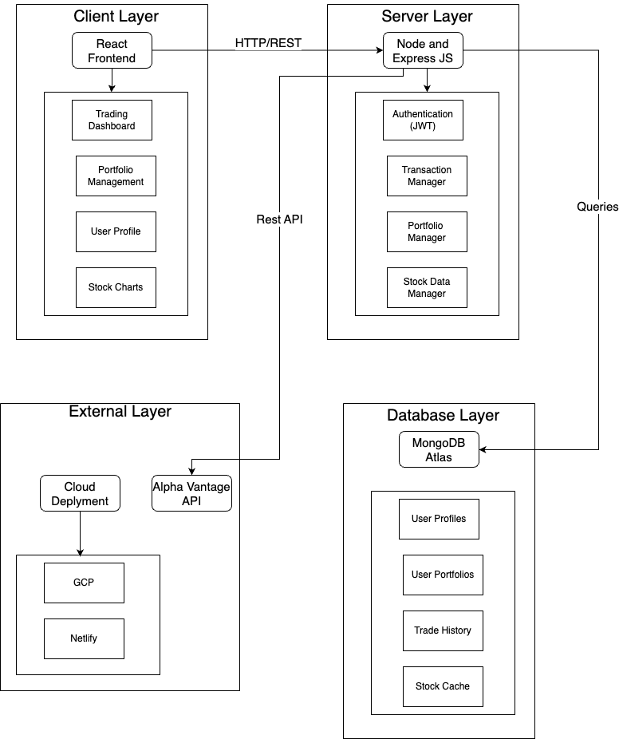

# MockMarket - A Stock Market Simulation
## Team Members

#### Manojdeep Dakavaram (manojdeep.dakavaram@colorado.edu)
#### Ramyashree Mummuderlapalli Krishnaiah (ramya.mummuderlapallikrishnaiah@colorado.edu)
#### Sumanth Sai Prasad (sumanth.saiprasad@colorado.edu)

## Project Overview
MockMarket is a comprehensive virtual stock trading platform designed to provide users with a risk-free environment to practice stock trading. The platform simulates real-world trading conditions using real-time market data, allowing users to develop and test trading strategies without financial risk.
## Project Goals & Achievements

✅ Implemented real-time stock price tracking and updates using Alpha Vantage API\
✅ Created a secure user authentication system with JWT tokens\
✅ Developed a robust portfolio management system with performance tracking\
✅ Built an interactive dashboard with real-time analytics and visualizations\
✅ Implemented a watchlist system with customizable price alerts\
✅ Created a responsive UI that works across desktop and mobile devices\
✅ Integrated automated testing and continuous integration pipeline

## System Components
### Software Components
1. Frontend Application

React.js with TypeScript for type safety\
Tailwind CSS for responsive design\
Recharts for data visualization\
React Router for navigation\
Context API for state management

2. Backend Server

Node.js with Express.js framework\
MongoDB for data persistence\
JWT for authentication\
WebSocket for real-time updates\
REST API endpoints

3. External Services

Alpha Vantage API for stock market data\
MongoDB Atlas for database hosting

### System Architecture


## Component Interactions

1. Frontend communicates with backend via RESTful APIs and WebSocket
2. Backend fetches real-time stock data from Alpha Vantage
3. MongoDB stores user data, portfolios, and trading history
4. WebSocket enables real-time price updates and notifications
5. JWT ensures secure authentication between frontend and backend

## Testing & Debugging
### Testing Mechanisms
1. Frontend Component Testing: Jest was used for unit testing React components to
ensure proper rendering and functionality.
2. Backend Unit Testing: Mocha and Chai were utilized for backend unit tests, covering
core logic such as user authentication, stock trading operations, and portfolio calculations.
3. Coverage Reports: Coverage reports were generated for both frontend and backend
unit tests to track the extent of code coverage and identify untested parts of the codebase.
4. API Endpoint Testing: Supertest was used to validate REST API endpoints, ensuring
proper request handling and response formats.
5. Component Integration: React Testing Library was employed to test the integration
between React components, simulating user interactions and verifying state updates.

### Debugging Tools

1. Chrome DevTools for frontend debugging
2. VS Code debugger for backend

## System Capabilities & Limitations
### Performance

1. Updates stock prices every 5 seconds
2. Average API response time < 200ms

### Known Limitations

1. Alpha Vantage API rate limits (25 calls/day on free tier)
2. Maximum 100 stocks in watchlist per user
3. Historical data limited to 2 years
4. No real-time WebSocket market data (polling-based updates)

## Installation & Deployment
### Prerequisites

1. Node.js v14+
2. MongoDB v4.4+
3. npm
4. Alpha Vantage API key

### Environment Setup
1. Clone the repository:
```bash
git clone https://github.com/cu-csci-4253-datacenter-fall-2024/finalproject-final-project-team-21.git
cd mockmarket
```
2. Install dependencies:
```bash
cd backend
npm install

cd ../frontend
npm install
```
3. Configure environment variables:
Backend .env:
```env
PORT=5001
MONGODB_URI=mongodb_uri
JWT_SECRET=jwt_secret
ALPHA_VANTAGE_API_KEY=api_key
NODE_ENV=development
```
Frontend .env:
```env
VITE_API_URL=http://localhost:5001
```
### Running the Application
1. Start the backend:
```bash
cd backend
npm run dev
```
2. Start the frontend:
```bash
cd frontend
npm run dev
```
Access the application at https://mockmarketsimulation.netlify.app/
### Production Deployment
1. Build frontend:
```bash
cd frontend
npm run build
```
2. Build backend:
```bash
cd backend
npm run build
```
3. Start production server:
```bash
cd backend
npm start
```
### Testing Locally:
```bash
cd __tests__
npm test
```

## Acknowledgments

1. Alpha Vantage for market data API
2. MongoDB Atlas for database hosting
3. CU Boulder CSCI 3753 course staff for project guidance